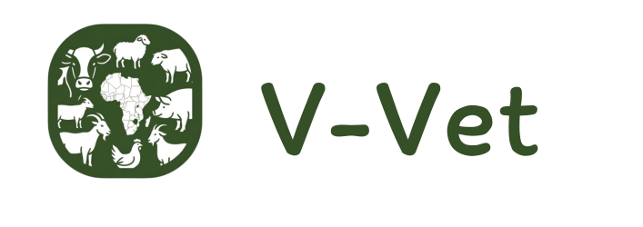

# AI-assisted livestock health support for smallholder farmers.

> Report symptoms through WhatsApp or web, get triage guidance quickly, and connect farmers to vets with full case context.




## Why V-Vet

Access to veterinary care is limited for many rural farmers. Delayed diagnosis and treatment can lead to avoidable livestock loss, lower household income, and food insecurity.

V-Vet helps close that gap by combining:
- Low-friction reporting channels farmers already use
- Structured digital health records for each animal
- Faster triage and vet response workflows

## What V-Vet Does

V-Vet enables a farmer to submit animal symptoms as voice, photo, or text, then routes the case through an AI-assisted triage flow and into a vet review pipeline when needed.

Core flow:
1. Farmer reports symptoms via WhatsApp or web.
2. AI processes multimodal input and prepares a structured triage output.
3. Historical livestock records are added for context.
4. Vet receives a prioritized case with recommendations and history.
5. Farmer receives next-step guidance and follow-up plan.

## Features

### WhatsApp-First Triage
- Capture symptoms through voice notes, images, or text in local language workflows.
- Transcribe and analyze input with multimodal AI services.
- Link incoming messages to existing farmer profiles by phone number.

### Farmer Dashboard
- Manage farms and livestock profiles.
- Record health observations, vaccinations, and treatments.
- Submit vet requests with urgency levels.

### Vet Dashboard
- Review assigned and prioritized cases.
- Access complete animal history before responding.
- Provide diagnosis, treatment recommendations, and follow-up instructions.

### Admin Operations
- Manage platform users.
- Assign vets to requests.
- Monitor request throughput and platform-wide activity.

## Architecture

| Layer | Technology |
|---|---|
| Frontend | React + Vite + TypeScript |
| Backend | FastAPI + SQLModel |
| Database | PostgreSQL |
| Messaging | WhatsApp Business API |
| AI Services | OpenAI, Gemma, ElevenLabs |
| Dev Environment | Docker Compose |

## Project Structure

```text
backend/   FastAPI app, models, migrations, tests
frontend/  React app, pages, components, hooks
scripts/   Root-level test and utility scripts
```

## Documentation

- Product scope and prototype behavior: [PROTOTTYPE.md](PROTOTTYPE.md)
- Backend development details: [backend/README.md](backend/README.md)

## Status

V-Vet is actively evolving. The current implementation supports core farmer, vet, and admin workflows with AI-assisted triage foundations in place.

## Contributing

Issues and pull requests are welcome. If you plan major changes, open an issue first to discuss scope and approach.

## Author

Built by [Godfrey Dekera](https://github.com/godfreydekew)
